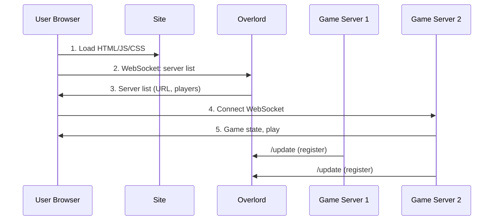

# Tankoids (mmorms)

A multiplayer real-time artillery tank game inspired by Worms. Play in your browser with tanks, shooting, jumping, shields, destructible terrain, and bots.

Play now: http://tankoids.vbo.name

## Architecture

- **mmorms** — Game server (Go). Physics, WebSocket game logic, terrain destruction, bots, leaderboard. Serves the web client and game WebSocket.
- **overlord** — Matchmaking server. Keeps a list of game servers and player counts. Clients connect to overlord first to pick the best server, then join the game.

### Runtime (multi-server)



### CI/CD

On push to `main` or `master`, GitHub Actions runs `.github/workflows/deploy.yml`: checkout, setup flyctl, compute version, then `fly deploy` (using `FLY_API_TOKEN` from repo secrets). Fly builds the Docker image remotely (Depot), pushes it to the registry, and deploys to the mmorms app. Overlord runs embedded in each mmorms instance; for multi-server scale-out, deploy overlord separately via `Dockerfile.overlord` and `overlord/fly.toml`.

## Requirements

- [Go](https://go.dev/) 1.22+ (or version in `go.mod`)
- Python 3 (for build/run scripts)

## Quick Start

```bash
python build_run.py
```

Then open **http://localhost:8080** in your browser.

This will:

1. Build `mmorms` (game server) and `overlord` (matchmaking server)
2. Start overlord on port 7070
3. Start mmorms on port 8080

## Manual Run

```bash
# Build both binaries
go build -o mmorms .
go build -o overlord ./overlord

# Start both servers
python singlebox.py
```

## Scripts

| Script | Description |
|--------|-------------|
| `build_run.py` | Build both binaries and start servers (Windows & Linux) |
| `singlebox.py` | Start overlord + mmorms only (expects binaries already built) |
| `cleanup.py` | Kill overlord and mmorms processes |

Press **Ctrl+C** in the terminal running `singlebox.py` to stop both servers.

## Controls

| Key | Action |
|-----|--------|
| ← → | Move |
| ↑ ↓ | Aim gun |
| C | Shoot (hold for more power) |
| X | Jump (hold for higher jump) |
| Z | Shield |

## Single-Server Mode

If the overlord is unavailable, the client falls back to connecting directly to the game server on the same host (e.g. `ws://localhost:8080/ws`), so you can run mmorms alone for local play.

## Project Layout

```
.
├── main.go        # Game loop, physics, maps
├── network.go     # WebSocket server, HTTP, overlord registration
├── bot.go         # AI bots
├── overlord/      # Matchmaking server
└── public/        # Static assets (index.html, game.js, render.js, maps)
```
